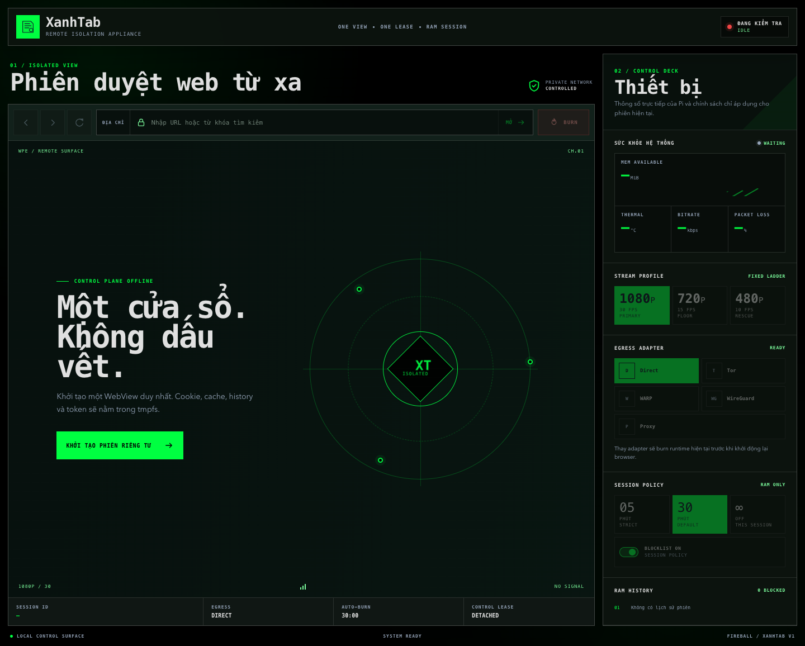
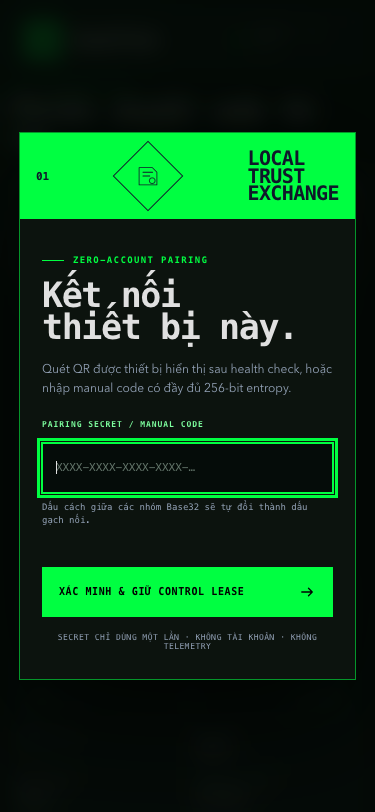
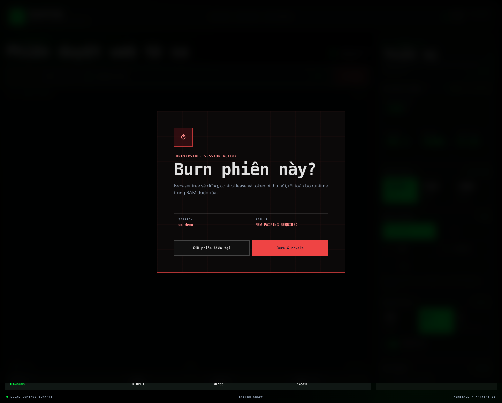

# XanhTab

XanhTab is the Raspberry Pi Zero 2 W remote-browser appliance in the Fireball Browser ecosystem. It exposes one WPE WebKit view to one paired controller over the local network or a private VPN. It has no account system, keeps sensitive session data in tmpfs, and treats Burn Session as a measured security lifecycle rather than a visual reset. If the controller authorization expires, the daemon burns any abandoned browser session and publishes new one-time pairing material even when inactivity auto-burn is disabled.

## Current implementation status

The repository contains the executable X0–X2 vertical slice, but **Gate X0 is not yet passed**. The latest real Pi Zero 2 W preflight on 2026-08-20 found missing `wpesrc`/`webrtcsink`, a repeatable V4L2 H.264 failure even at the 480p10 emergency profile, and a kernel boot with the memory cgroup disabled. See the [latest Gate X0 hardware report](docs/hardware-x0-2026-08-20.md) and the [previous 2026-08-18 capture](docs/hardware-x0-2026-08-18.md). Until the required hardware capture passes `scripts/evaluate-x0.sh`, the installer and dashboard are engineering candidates, not a release.

| Gate | Implemented here | Remaining go/no-go evidence |
| --- | --- | --- |
| X0 | WPE → conversion → V4L2 H.264 → `webrtcsink`, Opus branch, control DataChannel flag, 20-site/three-profile capture harness | Enable the cgroup v2 memory controller, supply `webrtcsink`, resolve the encoder failure, then complete the six-hour hardware run and latency/thermal/memory verdict |
| X1 | Three services, pairing, cookie/CSRF, one controller, FSM, tmpfs cleanup, FST blocklist, RAM history, auto-burn, and a redacted device-side burn audit | Run the packaged audit on Pi and retain a passing process/socket/auth/SLO report |
| X2 | Responsive clientless dashboard, navigation, session policy controls, profile ladder, version metrics, purpose-bound signaling relay, five adapter contracts, transactional nftables/process restart | End-to-end rswebrtc consumer handshake plus five-adapter IP/DNS/kill-switch hardware matrix |
| X3 | Signed-manifest packaging with pinned ARM64 rswebrtc plugin, verified/idempotent installer structure, repair/uninstall and rollback | Signed first release, fresh-install/upgrade matrix and 24-hour fault soak |

The three Fireball repositories may contain buildable F0 foundations, but their full product tracks remain gated until X3.

## Control surface preview

The production web client uses a local-only dark operations console. It includes the native video viewport, browser navigation, one-controller lease state, stream ladder, Direct/Tor/WARP/WireGuard/Proxy selection, auto-burn policy, blocklist state, RAM history, current device metrics, one-time pairing, and an explicit Burn Session confirmation.



<p align="center">
  
  
</p>

The control-plane image is a static development render and deliberately reports `OFFLINE` with metrics at `WAITING`. Dialog previews use a local `ui-demo` fixture only to show authenticated state; they are not device benchmarks. No live-device value is fabricated. In production, telemetry is marked `LIVE` only while the client is receiving a fresh sample; timed-out, stale and unauthenticated states are labeled explicitly.

[View the packaged `xanhtab://home` preview](docs/assets/xanhtab-internal-home.png).

## Components

- `xanhtabd`: Rust/Axum TLS control plane and static web client, unprivileged.
- `xanhtab-browser`: dedicated service for the WPE/GStreamer/WebKit process tree, capped at 400 MiB.
- `xanhtab-netd`: minimal privileged egress helper using validated enum commands and fixed argv execution.
- `web/`: industrial, responsive dashboard. The media surface is a native `<video>` element; no frame-by-frame canvas path exists.
- `schemas/`: config v1 JSON Schema and Control API v1 OpenAPI contract.

See [protocol v1](docs/protocol-v1.md) for trust boundaries and lifecycle semantics.

## Local development

Rust 1.85+ and Node are sufficient for the mock-backed control plane:

```sh
cargo test --all-targets
cargo run --bin xanhtabd -- --config config/xanhtab.toml
```

Open `http://127.0.0.1:8088`, then read the development pairing material from `/tmp/xanhtab-pairing.txt`. Development HTTP, mock browser, and mock egress are explicit in `config/xanhtab.toml`; production configuration refuses missing TLS.

Insecure development HTTP is restricted to loopback. A production configuration must use HTTPS and secure cookies, must explicitly allowlist its public origin, and must enable the real browser, network, and signaling backends. The daemon therefore fails closed instead of silently selecting mock implementations in production.

## Gate X1 burn audit

After installing a signed candidate on the Pi, run the packaged audit locally as root:

```sh
sudo /usr/local/libexec/xanhtab-x1-burn-audit
```

The audit pairs once, starts a session, proves that at least one session process appears in the browser service cgroup, then burns it. It verifies that the frozen pre-burn cookie is rejected, the public phase returns to `idle`, pairing material rotates, `/run/xanhtab-session` contains no file or socket, and no session process remains in that cgroup. It also enforces the measured burn SLO of less than five seconds. Secrets are passed through root-only files rather than process arguments. The redacted report is atomically written to `/run/xanhtab/x1-burn-audit.json` and follows [`schemas/burn-audit.schema.json`](schemas/burn-audit.schema.json); it contains no pairing secret, cookie, ticket, CSRF value, URL, or browsing history. If an intermediate check fails, the audit attempts an emergency burn and retains its root-only recovery material under `/run` only when cleanup cannot be confirmed. A passing report is required evidence, but does not replace the separate hardware X0 result.

## Gate X0 on hardware

Before changing packages or boot configuration, capture the bounded hardware-encoder matrix:

```sh
scripts/x0-encoder-probe.sh
```

The probe runs `videotestsrc` through `v4l2h264enc` in the diagnostic order 480p10, 720p15, 720p30, and 1080p30. Every attempted profile has a deadline, its own log, and before/after `CmaFree` evidence. It refuses to touch the encoder below a 32 MiB CMA safety floor and stops after the first failed profile by default; `--continue-after-failure` is reserved for a controlled diagnostic run and still rechecks the CMA floor before every profile. The probe creates a new, non-overwriting evidence directory containing `preflight.json`, redacted pre/post dmesg captures, a `summary.json` following [`schemas/encoder-probe.schema.json`](schemas/encoder-probe.schema.json), and `SHA256SUMS` for the complete bundle. MAC addresses, UUID/PARTUUID values, cloud-init instance IDs, USB serial values, and IPv4 addresses are removed during capture rather than after publication. A zero exit means the 720p15 release floor encoded successfully; it does not mean Gate X0 passed.

The current device must not be probed again before CMA recovery. Follow the approval, verification, and rollback sequence in the [Gate X0 remediation runbook](docs/x0-remediation-runbook.md).

On a supported Trixie Pi Zero 2 W, install the required WPE/GStreamer packages and build a release binary. Then run:

```sh
scripts/x0-gate.sh --profile-seconds 7200 --browser-bin target/release/xanhtab-browser
```

The harness runs 20 sites for two hours at each of 1080p30, 720p15, and 480p10 and captures memory, total browser-tree RSS/CPU, temperature, throttling and Wi-Fi signal. Add measured `stream-results.csv` and `latency-results.csv` using the documented headers, then run:

```sh
scripts/evaluate-x0.sh .x0-results/UTC_TIMESTAMP
```

The evaluator only returns GO when 720p15 has less than 2% frame drop, input latency p95 below 250 ms, browser/stream below 400 MiB, at least 48 MiB available, no OOM, and no sustained throttle. If only 480p10 passes, development freezes as required.

`scripts/x0-preflight-json.sh` performs read-only discovery of the Pi model, kernel, firmware, total/free CMA, encoder/render devices, active and boot-file cgroup intent, selected installed/candidate package versions, GStreamer ABI and required elements. It does not refresh APT metadata, install packages or modify boot configuration.

`npm ci && npm run test:schemas` compiles every JSON Schema as Draft 2020-12 and validates the real development/production TOML, published X0 evidence, the production release-manifest renderer and a passing X1 burn-audit fixture. Negative cases prove that unknown config/evidence fields, missing production TLS material, burn residue and malformed checksums are rejected.

## Verified installation

Do not pipe a network response into `sudo`. Download the installer, detached signature, and trusted public key separately; verify before execution:

```sh
curl --fail --location --proto '=https' --tlsv1.2 -O https://github.com/LamPPKK/XanhTab/releases/download/vX.Y.Z/install.sh
curl --fail --location --proto '=https' --tlsv1.2 -O https://github.com/LamPPKK/XanhTab/releases/download/vX.Y.Z/install.sh.minisig
minisign -Vm install.sh -x install.sh.minisig -p ./xanhtab-release.pub
sudo ./install.sh --non-interactive --public-key ./xanhtab-release.pub --network direct
```

The installer stops before mutation on a wrong OS, architecture, board, disabled memory cgroup, or missing cgroup v2 `memory` controller. Verification tools must already be installed. It downloads and verifies the signed manifest and then enforces its exact v1 contract: no unknown fields, complete component versions, exactly one safe-basename ARM64 artifact, a credential-free HTTPS URL and a lowercase SHA-256. It verifies the archive before APT mutation, rejects unsafe archive paths and symlinks, validates every component checksum and the plugin architecture, then checks the plugin against the installed GStreamer ABI. Before replacing product files it records service enable/running state and backs up all XanhTab-owned paths, including `/var/lib/xanhtab`. Any later failure restores those paths and service states; newly installed APT dependencies and newly allocated system accounts are deliberately outside that rollback boundary. The installer validates config, starts all services, and prints the QR only after health succeeds.

For protocol consumers, `scripts/package-contract-artifact.sh 0.1.0-dev.1` creates an explicitly unsigned development artifact containing OpenAPI, config/release schemas, the web client and checksums. It is not a production release.

For Git-backed public configuration, both `--config-repo` and immutable `--config-ref` are required. Only `config.json`, `custom_hosts.txt`, `bookmarks.json`, and `blocklist-metadata.json` are copied, each with a repository checksum and a 1 MiB limit. Secrets never come from that repository.

`--secrets-file` accepts root-owned mode-0600 JSON with only `wireguard_config_base64`, `proxy_url`, `stun_config_base64`, and `turn_config_base64`. Values are not logged; ICE files remain root-owned references and are not embedded in public config. WARP is encrypted egress, not anonymity; Tor uses remote DNS and a kill-switch contract.

## Security and scope

Container/service hardening is defense in depth, not a promise against every kernel escape or browser zero-day. Burn destroys authentication generations and encryption keys and removes tmpfs state; it does not claim physical overwrite of flash. Packages, non-secret config, the FST blocklist, and redacted security logs remain on disk.

XanhTab v1 does not expose the appliance to the public Internet and does not implement multi-tab, file upload/download, clipboard bridging, DRM/Widevine, WebRTC inside browsed pages, or extensions.
